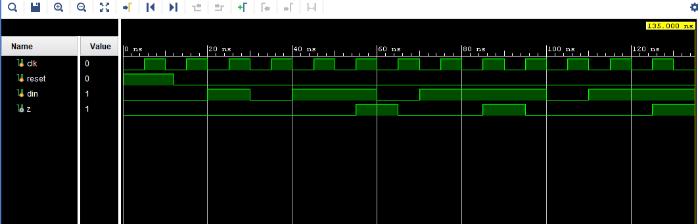
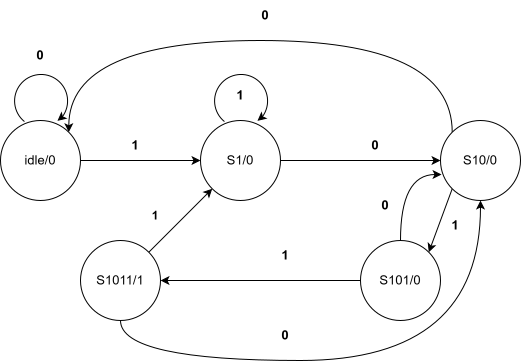
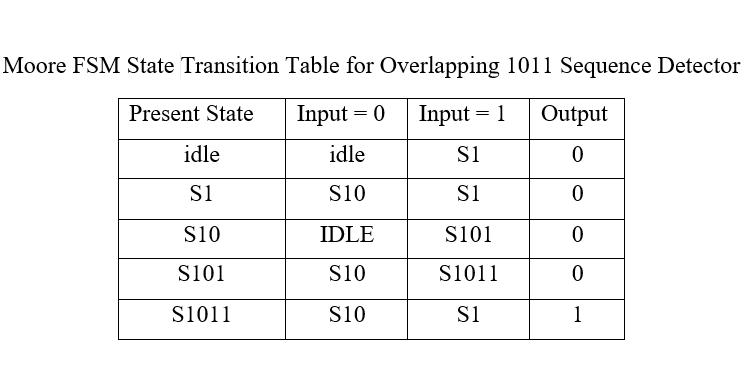

# FSM Sequence Detector (1011 Overlapping Pattern Detection)

## Overview

This project implements both **Moore** and **Mealy** Finite State Machines (FSMs) in Verilog HDL to detect the overlapping binary sequence **1011**.

The design demonstrates the differences between Moore and Mealy architectures in terms of state count, output generation, and detection latency.

## Features

* Detects the binary sequence **1011**
* Supports **overlapping sequence detection**
* Implements both **Moore FSM** and **Mealy FSM**
* Verified through simulation using dedicated verilog testbenches

---

## Moore FSM

### Description

In a **Moore Finite State Machine**, the output depends only on the **current state**.

### Inputs

| Signal | Width | Description         |
| ------ | ----- | ------------------- |
| clk    | 1     | System clock        |
| reset  | 1     | Asynchronous reset  |
| din    | 1     | Serial input stream |

### Outputs

| Signal | Width | Description       |
| ------ | ----- | ----------------- |
| z      | 1     | Sequence detected |

### State Sequence
```

IDLE 
↓
S1 
↓
S10
↓ 
S101
↓ 
S1011

```

## Simulation Results



## FSM State Diagram



## FSM State Table




---

## Mealy FSM

### Description

The Mealy FSM generates the output based on the current state and input. This allows sequence detection with fewer states compared to the Moore implementation.

### Inputs

| Signal | Width | Description         |
| ------ | ----- | ------------------- |
| clk    | 1     | System clock        |
| reset  | 1     | Asynchronous reset  |
| in     | 1     | Serial input stream |

### Outputs

| Signal | Width | Description       |
| ------ | ----- | ----------------- |
| out    | 1     | Sequence detected |

### State Sequence
```
IDLE 
↓ 
S1
↓  
S10
↓  
S101
```
---

## Project Structure

```text

FSM-Sequence-Detector/
│
├── Mealy
|    ├── RTL/
|    │    └── FSM_sequence_detector_ mealy.v
|    ├── TB/
|    │    └── FSM_Mealy_TB.v
|    ├── Simulation/
|    |    ├── Output.txt
|    |    └── waveform.png
|    └── Docs/
|         ├── State_diagram.png
|         └── State_table.png
├── Moore
|    ├── RTL/
|    │    └── FSM_sequence_detector_moore.v
|    ├── TB/
|    │    └── FSM_Moore_TB.v
|    ├── Simulation/
|    |    ├── Output.txt
|    |    └── waveform.png
|    |
|    └── Docs/
|           ├── State_diagram.svg
|           └── State_table.png
|
├── LICENSE
└── README.md

 ```          
--

## Simulation Results

    Refer Simulation/ waveform.png

---

## Comparison

| Feature           | Moore FSM            | Mealy FSM     |
| ----------------- | -------------------- | ------------- |
| States            | 5                    | 4             |
| Output Depends On | State                | State + Input |
| Detection Speed   | One clock later      | Immediate     |
| Complexity        | Simpler output logic | Fewer states  |

---

## Future Improvements

* Parameterized sequence detector
* SystemVerilog testbench
* Assertion-based verification
* Functional coverage implementation

```
```
